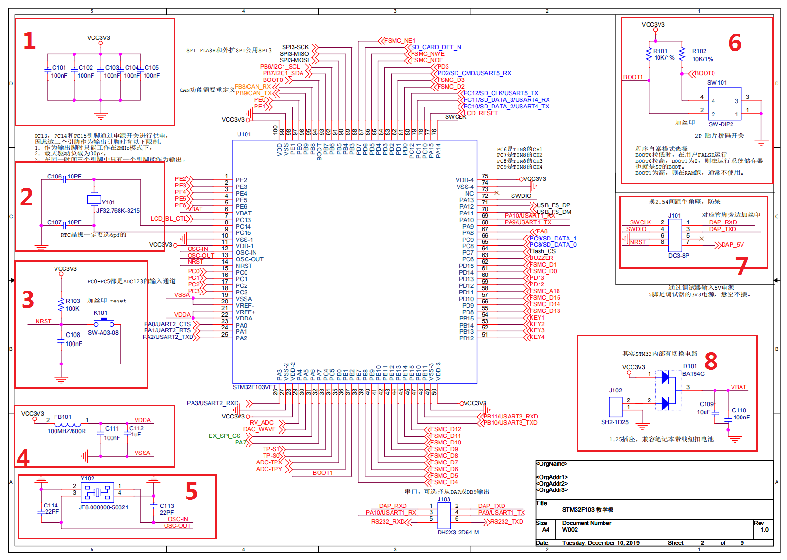
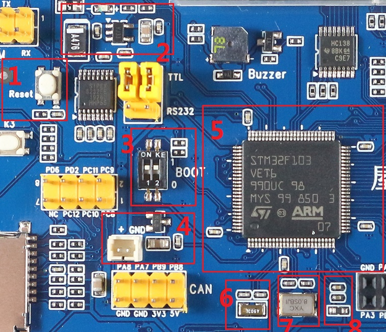

# 最小系统

在将单片机的最小系统之前，我们先来认识认识单片机。

## 为什么叫单片机？

纵观计算机的发展，最开始的计算机是一台巨无霸，后面技术更新，变小了，我们称之为微机。

微机，也就是最开始的电脑，发展到目前，电脑通常包含以下几个部件：

1. CPU
2. 主板
3. 硬盘
4. 显示器
5. 键盘鼠标
6. 内存

其中主板有包含了一堆外设：

那么单片机，也就是所谓的MCU，其实就是跟电脑相比。

因为在一颗芯片上，包含了CPU，硬盘、内存、一堆外设，就像一台小电脑一样。所以叫单片机。

我们看看STM32103VET的框图。在<STM32F103VET6 datasheet.pdf>文档中。

如下：

* 红框1中就是内核Cortex-M3，功能相当于电脑上的CPU。
* 红框2中是Flash，我们选的这款芯片片上包含512K。相当于电脑的硬盘，用于保存代码和数据。
* 红框3中的是SRAM，片上含64K。相当于电脑的内存。

> *有些同学可能觉得这个比喻不是很恰当，确实，现在的芯片有很多种类，有些芯片内部没有FLASH，有些芯片不含RAM。*
>
> 不过大家可以搜索一下苹果最开始的电脑，这些早起电脑就是用6052内核的芯片做的，现在在看功能其实相当简单，就像一个单片机一样。
>
> 6052的内核，在很多台系的单片机上还在使用，就像8051内核一样，持久不衰。

## 最小系统说明

单片机能工作的最小外围电路就叫做最小系统。

通常包含：

1. 时钟，也就是晶振。时钟相当于芯片的心脏，只有时钟，芯片才能工作。
2. 工作电源，这个不用解释了，所有电子设备都需要电源才能工作。不同的芯片工作电源不一样，有5V系统，3.3V系统，1.8V系统。
3. 其他一些必要的外部设置，例如启动模式选择。

#### 原理图

我们打开原理图，第一页，就是最小系统。居中的就是STM32F103VET6。

细分的话，整个最小系统分一下部分：

* 电源

  电源又分3部分，主电源，也就是上图中框图1，实际就是一个3.3V电源和一些电容。

  模拟电源，红框4中的电源就是，模拟电源由主电源通过磁珠等手段隔离而得。

  备份电源，红框8就是，用处是，低功耗下维持CPU的RTC和备份区功能。使用一个二极管并联，有外电时使用外电3.3V，没有外电时才使用纽扣电池电源。

* 主时钟，也就是CPU大部分外设工作的时钟。红框5的8M晶振电路就是主时钟。晶振电路通常都是由一个晶体和2个电容组成。晶体的频率就是主频。电容容值根据芯片设计，要匹配，否则晶体不起振。

* RTC时钟，红框2处即是，频率是32.768M。

* 复位电路，红框3处即是。用于复位CPU，通常是低电平复位。

  上电时，阻容电路没充电，复位脚是低电平，CPU进行复位，电容充满电后，复位脚是高电平，CPU复位完成。这就是常说的上电复位过程。

  正常工作中，按下按键，将复位脚拉低到低电平，进行复位。

* 启动选择电路，红框6就是STM32的启动选择电路。

* 调试口，红框7处就是调试口。什么是调试？通过电脑上的工具调试芯片。也就是我们常说的用JLINK通过JTAG口调试。现在，已经慢慢换成Daplink+SW口了，因为SW口用的线更少，更方便。

实际上，一个单片机，只需要：`主电源`、`主时钟`、`复位电路`，`驱动选择电路`， 芯片就能运行了。

很多芯片甚至不需要主时钟，使用芯片内部的时钟就可以运行代码。STM32也有内部时钟，只不过，相对外部晶振来说，内部时钟的精度会差很多。

#### 硬件最小系统

我们看下硬件实物的最小系统。

1. 红框1，是复位电路，按下复位按键系统就复位了。
2. 红框2，是电源电路，将外部的5V转换为3.3V。
3. 红框3，是启动选择电路。
4. 红框4，是纽扣电池电路。
5. 红框5，是主芯片和电源电路，4个电容要靠近芯片电源管脚。
6. 红框6，是实时时钟。
7. 红框7，是主时钟，8M频率。
8. 红框8，是模拟电源。

---

20200104

end