# 建立工程

本章节教大家创建一个STM32的工程。

开发环境使用MDK，也即是Keil。

**本文档只做概要说明，详细操作请参考视频教程**

### 安装

自己网上寻找安装方法。

#### 安装芯片支持包

在创建工程支持，需要新安装芯片支持包，否则在芯片中找不到我们需要的型号。

 按照下图代开Pack安装页面

在左边的Devices  中找到我们要的芯片系列，左键点击选中。

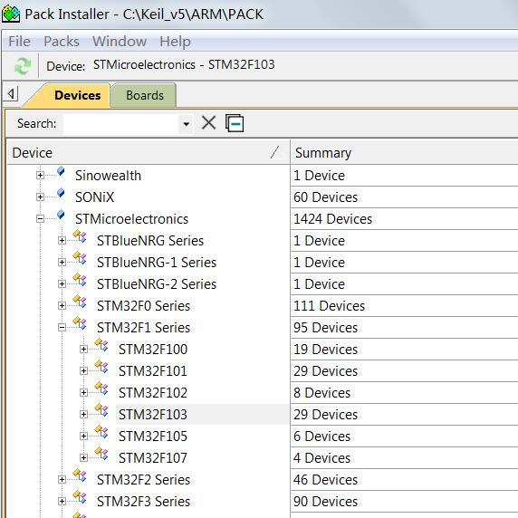

找右边就会显示对应的支持包，我们只需要安装基础包。也就是第二行的，截图是我的电脑，已经安装好了。

没安装时和其他一样显示Install，点击Install按钮就可以下载安装。

在底部的左边有安装信息，右边有安装进度。‘

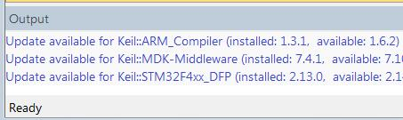

直接下载速度较慢，而且经常会断开。

我们可以直接导入下载好的pack文件， 在我们共享的资料中，ref\4  mdk目录下的Keil.STM32F1xx_DFP.2.3.0.pack文件就是F103的支持包。

点击`File`菜单中的`Import`，选择pack文件即可导入。

#### 创建工程

安装完成后，双击图标打开主界面如下。

点击菜单栏的`Help`->`About uVision`，可以查看到版本信息，我使用的是V5.24.2.0。

创建工程之前我们先配置IDE环境，

在`Configuration`的`Editor`页中，把`Automatic reload of externally modified files`

点击`Project`中的`New uVision Project` 创建新工程

选择芯片STM32F103VE

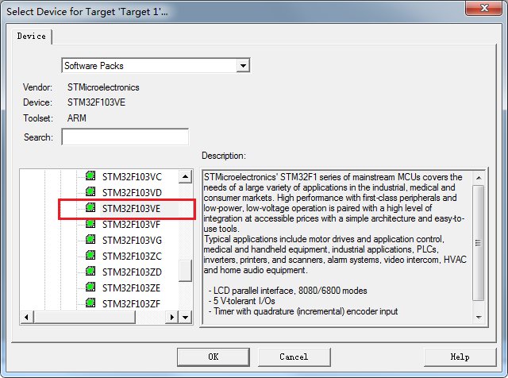

弹出界面让我们选择软件包，我们都不是使用这些软件库。点击OK跳过。

创建完成，现在得到一个空的工程。

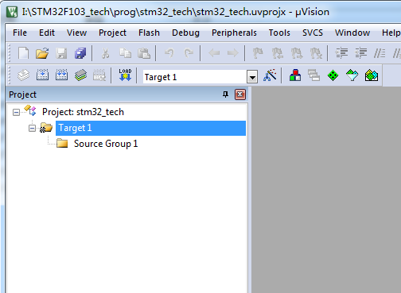

查看目录，现在只有工程文件，没有代码文件。

在目录中创建一个`mcu`文件夹。

把STM32F10x_StdPeriph_Lib_V3.5.0\Libraries下的STM32F10x_StdPeriph_Driver文件夹拷贝到mcu目录
名字太长，改为stdlib

拷贝STM32F10x_StdPeriph_Lib_V3.5.0\Project\STM32F10x_StdPeriph_Examples\GPIO\IOToggle 中的文件到mcu目录

拷贝STM32F10x_StdPeriph_Lib_V3.5.0\Libraries\CMSIS\CM3\DeviceSupport\ST\STM32F10x 中的源文件
拷贝启动代码，注意选对编译工具和型号
STM32F10x_StdPeriph_Lib_V3.5.0\Libraries\CMSIS\CM3\DeviceSupport\ST\STM32F10x\startup\arm

**待补充**

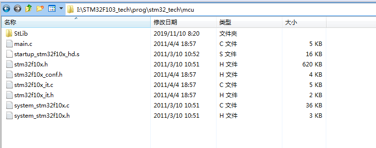

回到MDK

先选中目标名，再单击，修改为`stm32_tech`
同样修改源文件目录名

然后右键点击`mcu`，将刚刚拷贝到`mcu`目录的文件添加到工程的`mcu`下。

添加文件，添加启动代码的时候要注意，文件类型要选为ALL，才能看到**汇编文件**。

新建一个Stlib的文件夹，把库文件全部添加

点击编译，在下方框中输出编译过程的信息，编译结果显示24个错误。错误都是提示找不到.h文件。

原因是我们没有添加头文件存放的路径。

点击魔术棒进入Option，开始配置工程。

首先将晶振修改为8M

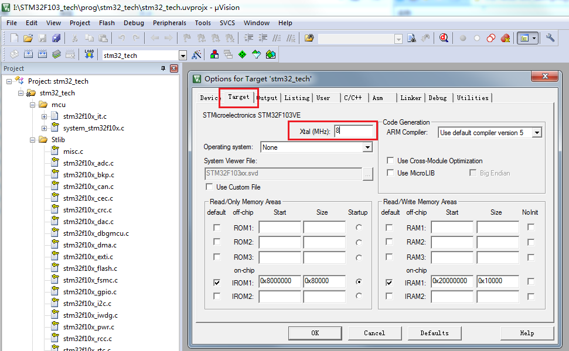

在Output页中勾选如下，选择生成hex文件。

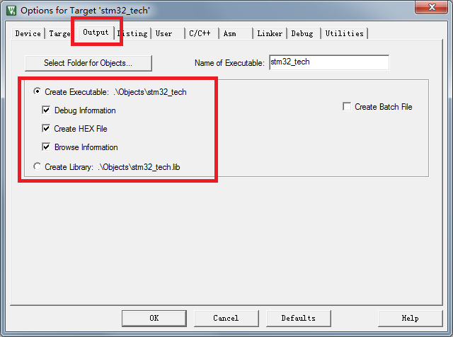

在C/C++页中，勾选上C99，并且将头文件存在的路径添加到Include Paths中。

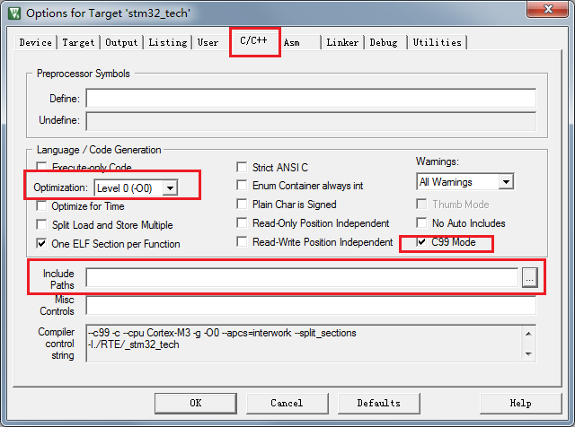

点击工程目录树中，找到stm32f10x.h，在65开始的地方，默认没有定义任何类型的芯片，我们要定义一个芯片。

> 有些库文件时只读，在图标上面有一个钥匙标志，需要先修改文件属性才能修改。

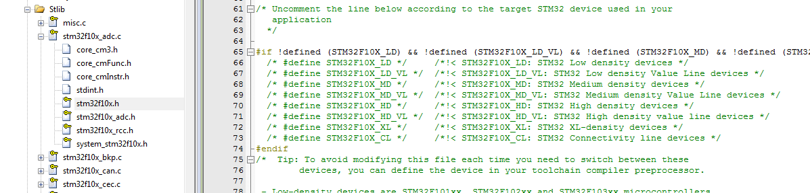

在这个文件的105行，打开这个宏，选择使用标准库。

编译，错误，原因是我们没有忘记添加启动文件了。

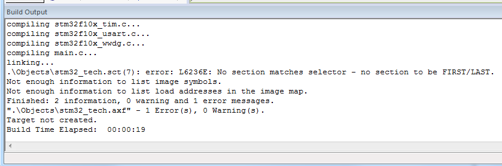

添加启动文件，文件类型要选择为ALL files才能选中汇编文件。

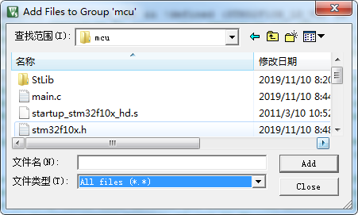

编译通过。

#### 下载

在工程Option中，Debug页，右上角，选择调试器，默认是ULINK2......，我们选在CMSIS-DAP。

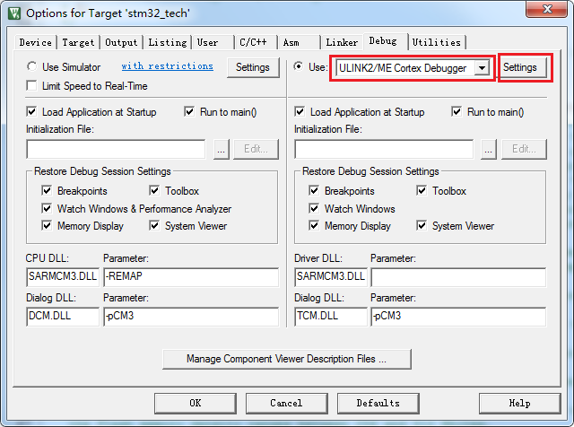

硬件连接正确的情况下，点击Settings，可以读到芯片。

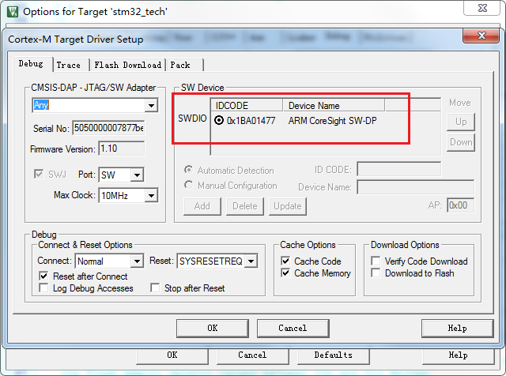

回到主界面，点击Debug，开始调试。

进入调试后界面如下。

左键点击行号旁边可以添加断点，黄色三角符号是当前执行位置。

各种调试按钮在菜单栏。

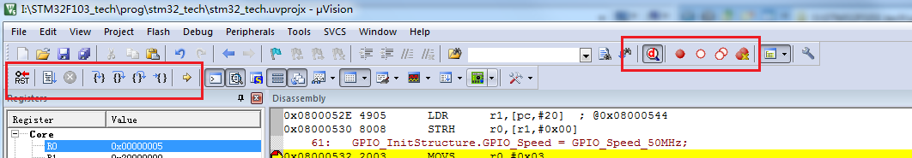

---

20200109

end