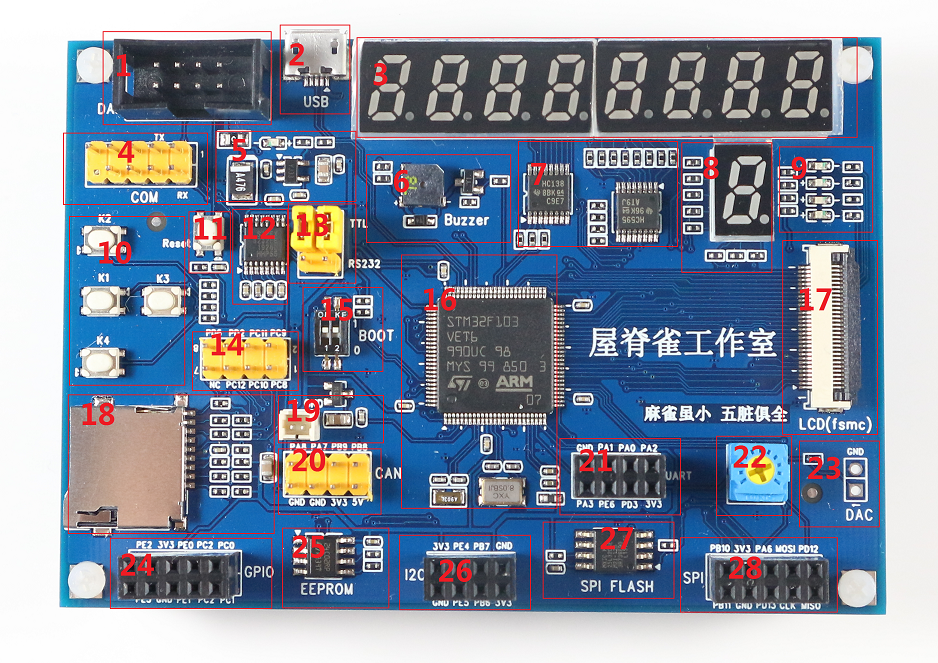
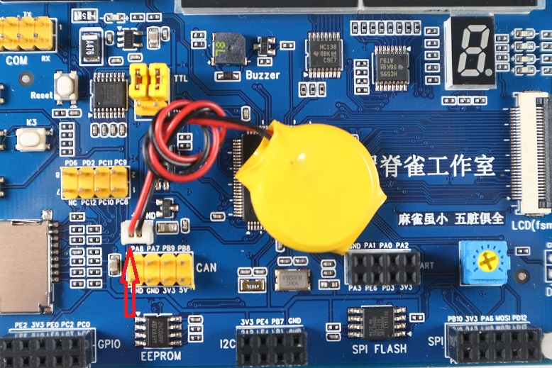
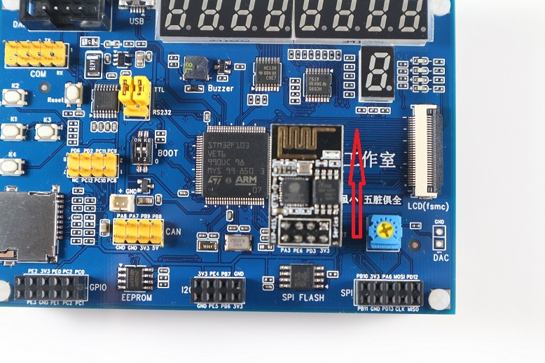
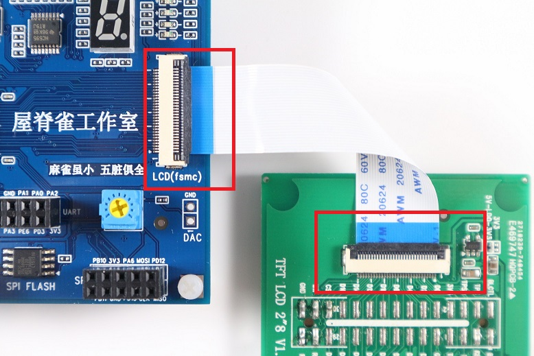

# 产品说明书

**够用的硬件**
**能用的代码**
**实用的教程**

> 屋脊雀工作室编撰 -201801227愿景：做一套能用的开源嵌入式驱动（非LINUX）
>
> 官网：www.wujique.com
>
> github: https://github.com/wujique
>
> 淘宝：https://shop316863092.taobao.com/?spm=2013.1.1000126.2.3a8f4e6eb3rBdf
>
> 资料下载：https://pan.baidu.com/s/12o0Vh4Tv4z_O8qh49JwLjg
>
> QQ群：767214262

## 关于教学板

本教学板专门针对入门学习与实验室教学设计。选择高配主控STM32F103VET，片上含512K FLASH、64K SRAM，不但能满足学习实验要求，还可支持更复杂的综合应用。VET为100脚封装，充足IO，减少IO复用，增加了外扩接口功能。相对低容量芯片，VET芯片支持SDIO和FSMC功能，可以做TF卡和TFT LCD实验。

按照学习实验要求选择外设，满足循序渐进的教学要求。接口标准化，兼容多种模块。

本教学板具有配置强劲、简单易用、携带方便、扩展性强、性价比高等特点，非常适合入门自学与实验室教学。

## 规格说明

工作电压：5V

尺寸：7里面X10厘米，板厚1.6毫米

## 模块说明

| 编号 | 功能           | 说明                                                         |
| ---- | -------------- | ------------------------------------------------------------ |
| 1    | DAP接口        | 包含电源、SW、串口。通过一个DAP接口，可实现供电、调试下载、查看LOG3个功能。 |
| 2    | USB口          | USB Device接口。可供电开发板工作。                           |
| 3    | 8位数码管      | 8位共阴极数码管，由模块7驱动。                               |
| 4    | COM口          | 串口，与电脑主板COM口兼容，1脚在右上，10脚无连接。输出RS232电平串口信号，可通过配套COM线连接电脑DB9接口。串口信号通过模块12和模块13控制。 |
| 5    | 电源模块       | 电源模块，包含LDO电路和保险电路。LDO将DAP接口或USB接口的5V转换为3.3V。保险丝为自恢复保险，电流大于500ma时保险丝断开。 |
| 6    | 蜂鸣器         | 蜂鸣器模块，通过PWM控制蜂鸣器鸣叫。                          |
| 7    | 数码管驱动模块 | 包含一片138、一片595，用于驱动8位数码管。IO口与FSMC复用。    |
| 8    | 数码管         | 一位段式数码管，共阴极，IO口直接驱动。IO口与FSMC复用         |
| 9    | LED            | 4位LED管。低电平点亮。IO口与FSMC复用。                       |
| 10   | 独立按键       | 4位独立按键                                                  |
| 11   | 复位键         | 按下复位STM32。                                              |
| 12   | RS232          | 串口电平转换芯片，将TTL电平转换为RS232电平。                 |
| 13   | 串口输出选择   | 通过跳线选择将LOG串口信号输出到DAP或RS232芯片。当选择输出到DAP接口时，通过DAP的USB口输出到电脑。当选择输出到RS232芯片时，串口通过模块4连接到电脑。 |
| 14   | SD卡信号       | 本接口通过排针将SD卡的信号引出，当不适用SD卡时，可做其他功能使用。 |
| 15   | BOOT选择       | 2位拨码开关，拨动到上时，为高电平。通常将两位都拨动到高电平即可。具体启动模式请参考后续章节。 |
| 16   | 主控           | STM32F103VET，片上512K FLASH、64K SRAM。封装LQFP100。        |
| 17   | LCD            | TFT LCD接口，使用STM32的FSMC接口。包含触摸屏输入信号。       |
| 18   | TF卡座         | TF卡座，4线SDIO接口，可接TF卡，也可接一些SDIO接口的模块。    |
| 19   | 电池插座       | 纽扣电池插座，兼容电脑主板带线纽扣电池。                     |
| 20   | 外扩接口1      | 包含电源、地、4根IO。                                        |
| 21   | 外扩串口       | 外扩串口，含流控信号，排布兼容安信可8266 WIFI模组。          |
| 22   | 精密电位器     | 用于ADC实验。                                                |
| 23   | DAC            | DAC输出信号。                                                |
| 24   | 外扩接口2      | 外口普通IO，含电源，排布兼容外扩I2C和外扩SPI。可模拟I2C或模拟SPI。也可用于其他普通IO实验，例如矩阵按键。 |
| 25   | EEPROM         | 默认焊接型号为24C02，256字节E2PROM。                         |
| 26   | 外扩I2C        | 外扩I2C接口，可接屋脊雀I2C接口的OLED屏幕。                   |
| 27   | SPI FLASH      | MX25L32，4MByte（32MBit），使用硬件SPI控制，SPI接口与外扩SPI口公用一组。 |
| 28   | 外扩SPI接口    | 排布可插屋脊雀的COG LCD、SPI接口的OLED、RF24L01等模组。SPI和SPI FLASH共用一组。 |

## 基本使用

#### DAP接法

配套一根灰**同向**灰排线，插头凸出点在外的接开发板。凸出点在内的一段，方向朝下接DAP。

接法如下图

#### COM口

配套有一根DB9公头灰排线，接线端子一端，红色为1脚，对应接开发板1脚。1脚无线，对应接无插针位置。

接法如下图

#### 纽扣电池

纽扣电池通过插座连接，兼容电脑主板电池。红线为正极，接座子丝印+极。

接法如下图

#### cog lcd

cog lcd可直接插到外扩的SPI接口，使用硬件SPI控制器控制。也可以接到外扩GPIO，使用IO模拟SPI。

LCD方向朝下，注意看电源与地即可。

接法如下图

#### WIFI模块

外扩串口兼容安信可WIFI模块，模组朝上插。

接法如下图

#### OLED(I2C)

外扩I2C接口可接屋脊雀OLED LCD模组。方向朝下。

接法如下图

#### OLED(spi)

屋脊雀OELD LCD模组，可以通过跳线改为SPI接口。可以接在外扩的SPI或GPIO座子。

**朝下靠右接**（可通过3V3和GND信号确认）

#### TFT LCD

屋脊雀TFT LCD使用FPC排线连接，开发板和模组的连接座皆是翻盖下接，也即是排线的金手指朝下。

接法如下图

#### BOOT选择

开发板使用拨码开关控制BOOT选择。

拨动到上位置为1，下位置为0。

左边为BOOT1，右边为BOOT0。

BOOT0=0时，在用户FALSH运行。

BOOT0=1，BOOT1=0，运行在系统储存器，也即是ST的BOOT。

BOOT0=1，BOOT1=1，运行在RAM。

---

20191222

**end**

